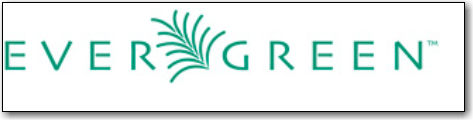

Evergreen System Administration at your Library
===============================================
Sitka's Evergreen Documentation
:doctype: book
:toc:
:numbered:

Introduction
============

This guide to Evergreen is intended to meet the needs of system administrators
at local libraries who use the staff client for their day-to-day work.

It is organized into Parts, Chapters, and Sections addressing key
aspects of the software. 

Copies of this guide can be accessed in PDF and HTML formats from http://docs.evergreen-ils.org/.

About Evergreen
----------------

include::sitka-style/sitka-style-about_evergreen.adoc[]

:leveloffset: -1

include::admin/web_client-login.adoc[]

:leveloffset: 0

include::admin/web_client-browser-tab-shortcuts.adoc[]

:leveloffset: -1

include::admin/librarysettings.adoc[]

:leveloffset: 0

Organizational Unit administration
==================================

// Cat
Cataloging administration
=========================

// Circ
Circulation administration
==========================

Circulation policies
--------------------

This section discusses the initial setup and subsequent troubleshooting and refinement of circulation policies.

Holds, transits, and resource sharing
-------------------------------------
